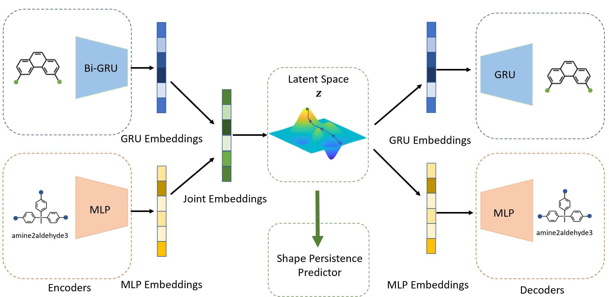

# Deep Generative Design of Porous Organic Cages via a Variational Autoencoder
This repository contains data and codes for Cage-VAE.

## Description


In this work, we present a VAE model, Cage-VAE, for the targeted generation of shape-persistent porous organic cages (POCs). We demonstrate the capacity of Cage-VAE to propose novel, shape-persistent POCs, via integration with multiple efficient sampling methods, including bayesian optimization and spherical linear interpolation.

## Contents
- Data

   - Please unzip `datasets.zip` and put `original_original.csv` and `dataset_augmented.csv` to `./datasets/` directory.

- Main

    - `dataset_analysis.py`: Overview of the original dataset.
    - `data_augmentation.py`: Methods used to create the augmented dataset.
    - `training.py`: Training of a new Cage-VAE.
    - `model_eval.py`: Integrated evaluations of an existing Cage-VAE.
    - `conditional_generation.py`: conditional generation of shape-persistent POCs using sampling methods.

- Utils

    - `analysis_utils`: import as a_utils, useful tools for the analysis of the generative model.
    - `encoding_utils`: import as e_utils, useful tools for molecular encodings and moiety modifications.
    - `VAE`: import as VAE, VAE architecture and methods.
    - `generation_utils`:import as g_utils, useful tools for molecular generations.
    - `utils`: import as utils, other utils.

- Results

    - `./cage/`: folder contains samples of generated POCs


## Requirements<br />

```
$ conda create --name cage-VAE python=3.7.11
$ conda activate cage-VAE
# install requirements
$ pip install numpy==1.21.5
$ pip install pandas==1.3.3
$ pip install matplotlib==3.2.1
$ pip install seaborn==0.11.2
$ pip install scikit-learn==0.22.1
$ pip install torch==1.9.1+cu111 -f https://download.pytorch.org/whl/torch_stable.html
$ pip install torchvision==0.2.2
$ conda install -c conda-forge rdkit=2020.09.1.0 
$ pip install stk==2021.8.2.0
$ pip install selfies==2.0.0
$ pip install GPyOpt==1.2.6
$ conda install -c conda-forge/label/cf202003 openbabel=3.0.0
$ conda install -c conda-forge pymatgen=2022.1.7
```

For running in an interactive window
```
$ pip install ipykernel==6.4.1
```
